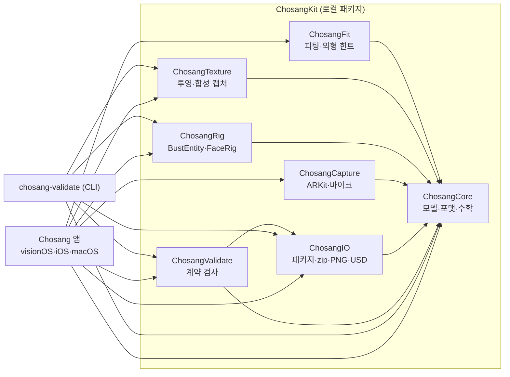
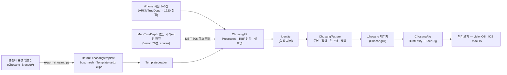
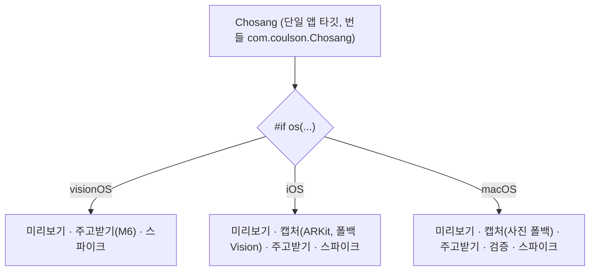
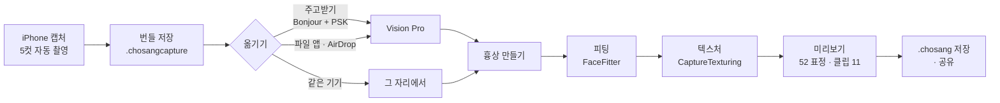

# 초상 (Chosang)

**사진 3–5장으로 만드는 나만의 흉상 페르소나** — visionOS 27 · iOS 26 · macOS 26.
블렌더 흉상 템플릿이 기하의 진실이고, iPhone(TrueDepth) 캡처는 "내 얼굴의 형상 차이 + 텍스처"만 공급한다. 완성된 페르소나는 ARKit 52 표정과 프리비즈 클립으로 움직이고 [소반](https://github.com/)(두레반 모임 앱)에 그대로 공급된다.

> 상태: **엔드투엔드 완성** — iPhone 으로 5컷 찍어 Vision Pro 로 보내면 **내 얼굴 흉상**이 선다.
> M1(템플릿)·M2(캡처) 완료, M6 전송과 M4 텍스처 1차 동작. 블렌더 템플릿 검증기 **오류 0 · 경고 0**, 테스트 59개.
> 실기기 확인: iPhone 16(전면 TrueDepth) 가이드 캡처 · Mac 사진 폴백 · Vision Pro 수신·피팅·텍스처·90 fps.

## 완성된 모습 — Vision Pro 실기기

iPhone 16 전면 TrueDepth 로 5컷을 찍어 Vision Pro 로 보내고, 그 자리에서 피팅 + 텍스처까지 돌린 결과다. 형상도 피부도 내 얼굴이다.

| 정면 | 비스듬히 | 옆 |
|---|---|---|
|  |  |  |

패치 RMS **0.93 mm** · 스케일 1.106 · 텍스처 512² 관측 **83 %** · `LowLevelDeformation (GPU)` **0.09 ms** · **90 fps**.
오른쪽 패널의 작은 이미지가 그 자리에서 만든 알베도다 — 얼굴이 아래쪽에 찍히는 것이 올바른 UV 방향이다.

**시연 영상** — iPhone 캡처부터 Vision Pro 흉상까지 한 번에:

[](https://youtu.be/oShsddRWeE8)

| visionOS 시뮬레이터 (기본 템플릿) | macOS (기본 템플릿, GPU) |
|---|---|
|  |  |

**캡처 — 두 경로, 한 번들 포맷**

| iPhone 16 실기기 — TrueDepth · ARKit (정면, 자동 촬영 직전) | iPhone 16 실기기 — 다음 컷 안내 (왼쪽 30°) |
|---|---|
|  |  |
| 각도·중립도·조도 게이트를 통과하면 "유지하세요" 와 함께 링이 0.7초 동안 차오르고 자동으로 찍힌다. 셔터도 초록으로 바뀐다 | 정면 칩에 체크가 들어오고 다음 컷으로 넘어간다. 링의 노란 점이 목표에서 벗어난 방향·크기를, 안내가 "고개를 조금 더 왼쪽으로" 를 알려 준다 |

| macOS 실기기 — 사진 폴백 캡처 (MacBook Air, FaceTime HD, Vision 76점) |
|---|
|  |
| 노란 점 = Vision 76 랜드마크, 하늘색 원 = 템플릿 `LandmarkName` 과 같은 핵심점(눈꼬리 4·코끝·입꼬리 2·턱). 왼쪽 30° 로 돌린 순간 yaw +30.9° 로 게이트 통과. 미리보기만 거울이고 저장 이미지는 비반전. 깊이·1220 정점 없이 `sparse = true` 로 저장 |

위 iPhone 화면의 흰 점은 ARKit 얼굴 메시 정점을 재투영한 것이다. 실기기 테스트로 **세로 기기 좌표계** 문제 두 가지와 게이트를 바로잡았다. ① **투영 회전** — 정점이 턱 아래로 밀린 것은 intrinsics 와 카메라 변환의 회전 방향이 180° 어긋난 탓이고, 같은 변환이 번들 `cameraTransform` 에 들어가 텍스처 투영까지 틀어질 문제였다. ② **자세 회전** — `ARCamera.transform` 의 x 축은 기기 긴 축이라 세로로 들면 월드 아래를 향한다. 회전을 빼먹으면 좌우 회전이 pitch 로 새어 나가 좌·우·위 컷이 영영 게이트를 통과하지 못한다(실측 `yaw −0.8° / pitch −33.8°`). **저장된 메타의 `cameraTransform` 은 이미 회전된 값**이라 다시 읽을 때는 더 돌리지 않는다 — 이 구분을 놓쳐 진단이 한 번 뒤집혔다. ③ **yaw 부호** — raw yaw 는 자기 오른쪽 회전이 +라 규약(+ = 내 왼쪽)과 반대였다. 왼쪽으로 돌리면 오른쪽 컷이 자동 촬영되던 증상이다. 가이드 각도만 뒤집고(`FacePoseConvention`) 저장값은 ARKit 원본 그대로 둔다. ④ **게이트 완화** — 허용치 ±9°/±8°, 중립도 상한 1.2, 중립도에서 시선 8개와 깜빡임 2개 제외. 넷 다 회귀 테스트로 묶었다(`Docs/TechPRD.md` §16·§18·§19·§20).

**구성** — iPhone 미리보기는 3D 전체 화면 + 하단 글래스 바(템플릿·턴테이블·**표정** 시트·정보), 클립은 가로 칩. 캡처는 전체 화면 카메라(거울) 위에 단계 칩 5개(찍은 컷은 썸네일) · 각도 링 · 조도 배너 · 안내 문장 · 셔터. 게이트 0.7초 유지 → 자동 촬영, 칩 탭 → 재촬영, 건너뛰기, 완료 후 저장·내보내기. 음성 안내(한국어)와 T-007 프로브는 ⓘ 진단 시트. TrueDepth 가 없으면 같은 화면이 사진 폴백(Vision 76점)으로 돈다. iPad·Mac 은 패널 레이아웃.

**Vision Pro 실기기 수치**

| 변형 경로 | 변형 | 프레임 | 피팅 | 텍스처 관측 |
|---|---|---|---|---|
| `LowLevelDeformation (GPU)` | 0.09 ms | 11.1 ms · 90 fps | 패치 RMS 0.71–0.96 mm | 78–83 % |

M5 성능 예산(GPU 변형 < 1 ms, 90 Hz)을 M1 코드가 이미 만족한다. 텍스처는 CPU 참조 구현이라 접합과 탈조명이 아직 거칠다 — 관측 밖(뒤통수·어깨 안쪽)은 평균 피부색으로 평탄화한다. 제대로 된 품질은 M4 본편(템플릿 알베도 합성 · Metal 커널 · 접합 색 보정 · 탈조명, 목표 PSNR 32 dB).

**텍스처를 맞추기까지** — 좌표 규약을 세 번 틀렸고 매번 **실제 데이터를 찍어** 바로잡았다.
① 투영 회전(intrinsics 와 카메라가 180° 어긋남) → 정점 오버레이가 턱 아래로.
② **코너 UV** — `bust.mesh` 는 UV 를 두 벌 담는다. 솔기용 코너 UV 대신 정점당 호환 UV 로 래스터화해 삼각형이 UV 평면을 가로질렀다(알베도가 방사형 줄무늬). `makeRenderMesh()` 로 교체하니 관측이 24 % → 78 % 로.
③ **세로축** — 얼굴 UV 는 v 가 작아(코끝 0.260 · 턱 0.050) 알베도 **아래쪽**에 찍힌다. 뒤집어 올렸더니 얼굴 색이 어깨로 내려갔다. 기본값을 "반전 없음" 으로.
`swift run chosang-validate --texture <번들> <out.png>` 로 실기기 왕복 없이 알베도와 랜드마크 UV 를 확인한다.

**번들** — 두 경로 모두 `Documents/Captures/<uuid>/`(meta.json · shot-*.jpg · depth-*.f32 · thumb-*.jpg)에 저장하고 "내보내기" 로 `.chosangcapture`(zip)를 공유한다. 밀집 피팅(`FaceFitter`)은 희소 번들을 한국어 사유로 거부하며, 희소 피팅은 M3 T-306.

**주고받기 — Bonjour `_chosang._tcp` + TLS PSK 6자리 (M6 T-603)**

| 받기 (Vision Pro·Mac) | 보내기 (iPhone·Mac) |
|---|---|
|  |  |
| 수신 대기를 켜면 기기 이름으로 광고하고 **6자리 코드**를 띄운다. 받는 동안 진행률, 끝나면 `Documents/Received/` 에 저장하고 목록에 쌓인다. 받은 `.chosang` 은 "미리보기에서 열기" 로 바로 적용 | 파일을 고르거나 "최근 캡처 쓰기" 로 방금 찍은 번들을 묶고, 근처 기기를 찾아 코드를 넣으면 64 KB 씩 보낸다 |

코드 문자열이 그대로 TLS 사전 공유 키라서 **코드가 틀리면 핸드셰이크 단계에서 끊기고 한 바이트도 넘어가지 않는다**(테스트로 확인). 같은 Wi‑Fi 가 아니어도 근거리면 붙는다(`includePeerToPeer`). Mac 두 인스턴스 실측: 발견 즉시, 300 KB 1.1초. 🧪 iPhone → Vision Pro 실기기 확인은 T-608.

52 셰이프 시트(macOS, `sheet=1`): 

## 아키텍처

**모듈 의존성** — `ChosangCore` 가 유일한 기반(Foundation/simd/CoreGraphics 만). 나머지는 전부 Core 하나에만 의존해 순환이 없다.



**데이터 흐름** — 블렌더 흉상이 기하의 진실, 사진은 형상 차이와 텍스처만 공급한다.



**플랫폼 분기** — 소스는 한 타깃, `#if os(...)` 로만 갈린다(CLAUDE.md 원칙).



## 구조

```
Chosang/               앱 타깃 Chosang (번들 com.coulson.Chosang, 구 MyApp) — 3 플랫폼 한 타깃, #if os 분기
  App/                 ChosangApp · AppModel · LaunchOptions
  Views/               미리보기(RealityView + 52 슬라이더 + 클립; iPhone 은 전체 화면 + 글래스 바 + 시트) · 스파이크 · 캡처(iOS: GuidedCaptureView — ARKit·사진 폴백 공용) · 사진 폴백 캡처(macOS 패널) · 주고받기(TransferView) · 검증(macOS)
  Chosang.entitlements 샌드박스 + 카메라 · 오디오 입력 · 사용자 선택 파일 · 네트워크
  Resources/Templates/Legacy/   소반 USDZ(임시 템플릿)
ChosangKit/            로컬 Swift Package
  ChosangCore          모델(BustTemplate·CaptureBundle·Identity·SampledClip·manifest)·포맷(bust.mesh·identity.bin)·수학(Procrustes·RBF·TPS)·합성 템플릿/클립
  ChosangFit           FaceFitter(정렬·중립화·패치 치환·두상 전파)·AppearanceHints(FoundationModels)
  ChosangTexture       CPU 래스터라이저·합성 캡처 번들·CPU 투영 텍스처·CaptureTexturing(실제 캡처 → 알베도)
  ChosangRig           TemplateLoader(USDZ)·BustEntity(LowLevelMesh + LowLevelDeformation/CPU)·FaceRig·ClipPlayer
  ChosangCapture       FaceCaptureSession(iPhone ARKit, 미리보기+정점 투영)·PhotoCaptureSession(Mac·폴백: AVCapture + Vision 76점)·CaptureGuide(5컷 상태 기계)·FacePoseConvention(자세 부호 규약)·SpeechGuide(음성 안내)·MicLevelMeter
  ChosangIO            .chosang 패키지·캡처 번들·ZipArchive·PNG/JPEG·USD 내보내기·ChosangTransfer(Bonjour + TLS PSK 전송)
  ChosangValidate      템플릿·클립 계약 검사 (+ `chosang-validate` CLI)
  Tests/               Swift Testing — 셀프 피팅·텍스처·검증기·포맷 왕복·희소 캡처 기하·캡처 가이드·포트레이트 회전·얼굴 자세(실측)·전송·캡처 텍스처링·알베도 평탄화·코너 UV·세로축 규약 (59 테스트)
tools/blender/export_chosang.py   블렌더 내보내기 (Template.usdz · library/*.usdz · bust.mesh v2 · template.json · library.json · clips · textures · source)
tools/make_default_template.sh    Template 폴더 → 앱 번들용 Default.chosangtemplate (stored zip)
Chosang_Blender/                  블렌더 작업 파일(.blend, LFS)·결정적 빌드 스크립트·텍스처·Apple OBJ(+라이선스)·Template/ 산출물(usdz 제외)
Fixtures/              합성 캡처 번들 2종 (.chosangcapture) — 실제 캡처 데이터는 절대 커밋하지 않음
Docs/                  TechPRD.md · Tasks.md · Blender-요청.md · Spikes.md · Prompt.md · screenshots/
```

## 시작하기

```bash
# 테스트 (Mac)
cd ChosangKit && swift test

# 블렌더 내보내기 (블렌더 쪽에서) + 계약 검증기
/Applications/Blender.app/Contents/MacOS/Blender -b ~/Desktop/Chosang_Blender/Chosang_Template.blend \
  --python tools/blender/export_chosang.py -- --out ~/Desktop/Chosang_Blender/Template
swift run chosang-validate ~/Desktop/Chosang_Blender/Template --with-usdz   # RealityKit 교차 확인 포함
swift run chosang-validate --synthetic /tmp/ChosangTemplate                 # 합성 템플릿으로 자체 검사
../tools/make_default_template.sh ~/Desktop/Chosang_Blender/Template         # 앱 번들 갱신
swift run chosang-validate --list-legacy-failures                # 소반 USDZ 로 실패하는 항목 = 블렌더 작업 우선순위
swift run chosang-validate --make-fixture ../Fixtures/x.chosangcapture [perturbed]
swift run chosang-validate --texture <번들.chosangcapture> /tmp/albedo.png 512   # 실제 캡처 → 피팅 + 알베도 PNG (텍스처 디버깅)

# 앱 (Xcode 에서 Chosang 스킴). 시뮬레이터 자동 실행 인자:
#   template=default|synthetic|legacy  clip=<idle_breathe|…|bow>  tab=preview|capture|validate|spikes|receive  fixture=perturbed  report=1  sheet=1  previz=1  camera=1  receive=1  browse=1
# Xcode 없이 macOS 앱 빌드·실행 (인자는 환경변수로 — 대시 없는 명령행 인자는 AppKit 이 "열 문서" 로 취급해 창이 안 뜬다):
xcodebuild -project Chosang.xcodeproj -scheme Chosang -destination 'platform=macOS' -derivedDataPath ~/Library/Developer/Xcode/DerivedData/Chosang-cli build
open -n ~/Library/Developer/Xcode/DerivedData/Chosang-cli/Build/Products/Debug/Chosang.app --env CHOSANG_ARGS="tab=capture camera=1"
```

## 한 바퀴 — 캡처에서 흉상까지



1. **캡처** — iPhone 캡처 탭에서 "시작". 각도·표정·조도 게이트가 0.7초 유지되면 자동으로 찍힌다. 5컷을 마치면 "번들 저장".
2. **옮기기** — 주고받기 탭 › 보내기에서 "최근 캡처 쓰기" → 받는 기기를 고르고 6자리 코드 입력. 또는 파일 앱 › 나의 기기 › 초상 › `Captures/` 에서 AirDrop.
3. **흉상** — 받기 화면의 "이 캡처로 흉상 만들기". 같은 기기에서 찍었다면 미리보기 패널의 "내 캡처로 흉상 만들기" 로 전송 없이 바로.
4. **확인·저장** — 52 표정 슬라이더와 클립 11종이 내 얼굴 형상으로 움직인다. ".chosang 저장" 으로 묶어 공유.

## 지금 되는 것

- 기본 템플릿(블렌더, 11,569 정점 · 52 셰이프 · 뼈 6 · 클립 11 · 라이브러리 19) 미리보기 — bust.mesh 기하 + Template.usdz 눈알·입안, Mac GPU `LowLevelDeformation`.
- 2차 계약 검증기(규칙 40여 개, 한국어 수정 문장, `--with-usdz`), 내보내기 스크립트(헤드리스 4.5 s), 셰이프 시트, 프리비즈 카메라 프리셋.
- **가이드 캡처(T-201~T-204)** — 5컷 상태 기계(`CaptureGuide`: 게이트 0.7초 유지 → 자동 촬영, 건너뛰기, 재촬영), iPhone 전체 화면 UI(각도 링·단계 칩 썸네일·조도 배너·음성 안내), 번들 저장·썸네일·`.chosangcapture` 내보내기. ARKit·사진 폴백 공용.
- **엔드투엔드** — 캡처 번들에서 "흉상 만들기" → 밀집 피팅(실측 패치 RMS **0.71–0.96 mm**) → 512² 알베도 투영(관측 **78–83 %**) → 미리보기, `.chosang` 으로 저장·공유. 받은 번들·같은 기기 번들 모두 가능하고, "템플릿 원본으로" 로 즉시 비교한다.
- **주고받기(T-603)** — Bonjour `_chosang._tcp` 광고·검색, TLS PSK 6자리 코드, 64 KB 청크·진행률, `Documents/Received/` 저장, 받은 페르소나를 미리보기에 적용. Mac 루프백 실측 통과.
- **파일 경로(T-604)** — 파일 앱 › 나의 기기 › 초상 에서 `Captures/`·`Received/` 가 그대로 보인다. AirDrop·파일 앱·공유 시트로 넘어온 `.chosang`/`.chosangcapture` 는 `onOpenURL` 이 받아 바로 열고, 받기 화면의 "파일에서 불러오기" 로도 연다.
- **사진 폴백 캡처(T-205)** — Mac 내장 카메라·사진 파일·TrueDepth 없는 iPhone: Vision 76점(revision 3 고정) + 자세 → 핵심점(좌/우는 이미지 x 로 결정)·가정 FOV intrinsics·눈 간격 기반 얼굴 변환 추정, 8프레임 평균, 5컷 게이트(각도·밝기·얼굴 폭). `CaptureShotMeta` 에 `landmarks2D`·`keyPoints2D`·`faceBox`·`poseEstimate`·`intrinsicsEstimated` 추가(옛 번들 호환). 기하는 `SparseFaceGeometry`(Core, 테스트 5개).

## M0 에서 된 것

- 합성 템플릿(1220 패치 + 두상·목·어깨 6.7k 정점, 52 셰이프, 뼈 6) 미리보기 — Mac 은 `LowLevelDeformation` GPU 경로(0.14 ms), 시뮬레이터는 CPU 폴백.
- 절차적 클립 11종(계약과 같은 이름·길이·루프) 재생·크로스페이드, 52 슬라이더, 자동 깜빡임·시선.
- 소반 USDZ 로드 보고(T-004) — 셰이프 델타·스킨·조인트가 `MeshResource.contents` 에서 읽힌다.
- 합성 캡처 번들(5컷 RGB·깊이·1220 정점·52 가중치·조명) → 피팅 → Identity → CPU 텍스처 투영까지 한 번에 도는 테스트.
- `.chosang`/`.chosangcapture`/`bust.mesh`/`identity.bin`/`clip.json` 포맷과 왕복 테스트, 계약 검증기(한국어 수정 문장).

## 실기기에서 확인할 것 (🧪)

`Docs/Tasks.md` 맨 아래 체크리스트.

**확인 끝난 것** — iPhone 16(전면 TrueDepth): 가이드 5컷 자동 촬영, T-007 프로브(정점 1220 · 삼각형 2304 · 해시 `67161fe4685cdd1e` · 깊이 640×480 · **조명 방향 추정 없음**), 번들 저장·내보내기. Vision Pro: 수신(T-608), 피팅, 텍스처, GPU 변형 0.09 ms · 90 fps, 2D 창 표시. Mac: 사진 폴백 캡처, 전송 루프백.

**남은 것** — 흉상 2개 동시 90 Hz, 캡처 완주 3회·안경/마스크 게이트(T-206), 실기기 픽스처 3세트(T-207).

## 다음

| 마일스톤 | 남은 일 |
|---|---|
| **M3 피팅** | 실루엣 맞춤(T-303), jawOpen 진폭 보정, 사진 폴백용 **희소 피팅**(T-306 — 지금은 `FitError.sparseBundle` 로 거부) |
| **M4 텍스처** | 템플릿 알베도를 베이스로 합성, Metal 커널, 접합 색 보정(T-403), 탈조명(T-404) — 목표 PSNR 32 dB (현재 CPU 참조 24 dB 급) |
| **M5 런타임** | 머리카락·안경 라이브러리 선택, 흉상 2개 동시, 라이브 표정 |
| **M6 나머지** | `.sobanpersona` 어댑터(T-605), USDZ 내보내기(T-606), 소반 통합(T-607) |

## 라이선스

Apache-2.0 (`LICENSE`, `NOTICE`). 소반에서 이식한 코드도 같은 라이선스.
