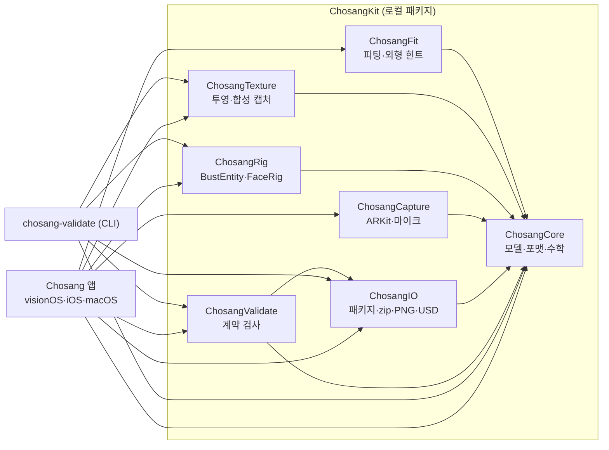
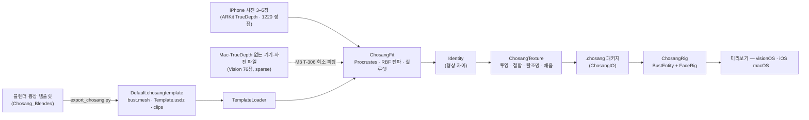
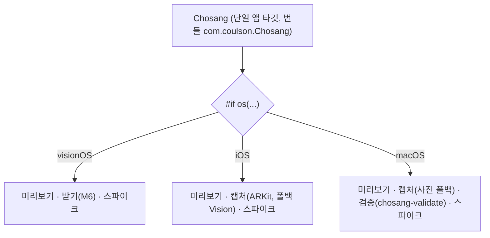

# 초상 (Chosang)

**사진 3–5장으로 만드는 나만의 흉상 페르소나** — visionOS 27 · iOS 26 · macOS 26.
블렌더 흉상 템플릿이 기하의 진실이고, iPhone(TrueDepth) 캡처는 "내 얼굴의 형상 차이 + 텍스처"만 공급한다. 완성된 페르소나는 ARKit 52 표정과 프리비즈 클립으로 움직이고 [소반](https://github.com/)(두레반 모임 앱)에 그대로 공급된다.

> 상태: **M1 2차 완료 + M2 선행 T-205(사진 폴백 캡처) 3차** — 블렌더 템플릿(`Chosang_Blender/`, 10/3 저녁 갱신: 귀 v2·`Shoulders_shirt` 추가·프리비즈 재렌더) 반입, 2차 계약·내보내기 스크립트·검증기 완료. 앱은 번들 `Default.chosangtemplate`(bust.mesh + Template.usdz + EyesMouth.usdz) 로 돈다. 검증기 **오류 0 · 경고 0**. **Mac 에서도 캡처**: TrueDepth 없이 내장 카메라·사진 파일 + Vision 76점으로 희소 번들(`sparse = true`)을 만든다 — Mac 실기기 확인.

| visionOS 시뮬레이터 (기본 템플릿) | macOS (기본 템플릿, GPU) |
|---|---|
|  |  |

**캡처 — 두 경로, 한 번들 포맷**

| macOS 실기기 — 사진 폴백 캡처 (MacBook Air, FaceTime HD, Vision 76점) | iPhone 16 실기기 — TrueDepth · ARKit 캡처 |
|---|---|
|  |  |
| 내장 카메라 1920×1080, 노란 점 = Vision 76 랜드마크, 하늘색 원 = 템플릿 `LandmarkName` 과 같은 핵심점(눈꼬리 4·코끝·입꼬리 2·턱). 왼쪽 30° 로 고개를 돌린 순간 yaw +30.9° 로 게이트 "유지하세요". 미리보기만 거울이고 저장 이미지는 비반전. 깊이·1220 정점 없이 `sparse = true` 로 저장 | 🧪 **촬영 대기**: iPhone 16 실기기에서 캡처 탭 → "세션 시작" → T-007 프로브(정점 1220·삼각형 해시·깊이 640×480) 가 뜬 화면을 찍어 `Docs/screenshots/m2-iphone16-truedepth-capture.png` 로 저장하면 이 칸에 들어간다(절차: `Docs/Spikes.md` T-007). 시뮬레이터 화면(`m1-ios-sim-capture.png`)은 ARFaceTracking 이 없어 사진 폴백 뷰가 뜬다 |

Mac 캡처는 "캡처" 탭에서 "카메라 시작"(또는 실행 인자 `camera=1`), 5컷 각각 "촬영" 또는 "파일…"(사진 파일), "번들 저장" → `~/Library/Containers/com.coulson.Chosang/Data/Documents/Captures/<uuid>/`. 밀집 피팅(`FaceFitter`)은 희소 번들을 한국어 사유로 거부하며, 희소 피팅은 M3 T-306.

52 셰이프 시트(macOS, `sheet=1`): 

## 아키텍처

**모듈 의존성** — `ChosangCore` 가 유일한 기반(Foundation/simd/CoreGraphics 만). 나머지는 전부 Core 하나에만 의존해 순환이 없다.



**데이터 흐름** — 블렌더 흉상이 기하의 진실, 사진은 형상 차이와 텍스처만 공급한다.



**플랫폼 분기** — 소스는 한 타깃, `#if os(...)` 로만 갈린다(CLAUDE.md 원칙).



## 구조

```
Chosang/               앱 타깃 Chosang (번들 com.coulson.Chosang, 구 MyApp) — 3 플랫폼 한 타깃, #if os 분기
  App/                 ChosangApp · AppModel · LaunchOptions
  Views/               미리보기(RealityView + 52 슬라이더 + 클립) · 스파이크 · 캡처(iOS ARKit) · 사진 폴백 캡처(macOS · iOS 폴백) · 검증(macOS)
  Chosang.entitlements 샌드박스 + 카메라 · 오디오 입력 · 사용자 선택 파일 · 네트워크
  Resources/Templates/Legacy/   소반 USDZ(임시 템플릿)
ChosangKit/            로컬 Swift Package
  ChosangCore          모델(BustTemplate·CaptureBundle·Identity·SampledClip·manifest)·포맷(bust.mesh·identity.bin)·수학(Procrustes·RBF·TPS)·합성 템플릿/클립
  ChosangFit           FaceFitter(정렬·중립화·패치 치환·두상 전파)·AppearanceHints(FoundationModels)
  ChosangTexture       CPU 래스터라이저·합성 캡처 번들·CPU 투영 텍스처(참조 구현)
  ChosangRig           TemplateLoader(USDZ)·BustEntity(LowLevelMesh + LowLevelDeformation/CPU)·FaceRig·ClipPlayer
  ChosangCapture       FaceCaptureSession(iPhone ARKit)·PhotoCaptureSession(Mac·폴백: AVCapture + Vision 76점)·MicLevelMeter
  ChosangIO            .chosang 패키지·캡처 번들·ZipArchive·PNG/JPEG·USD 내보내기 능력
  ChosangValidate      템플릿·클립 계약 검사 (+ `chosang-validate` CLI)
  Tests/               Swift Testing — 셀프 피팅·텍스처·검증기·포맷 왕복·희소 캡처 기하 (23 테스트)
tools/blender/export_chosang.py   블렌더 내보내기 (Template.usdz · library/*.usdz · bust.mesh v2 · template.json · library.json · clips · textures · source)
tools/make_default_template.sh    Template 폴더 → 앱 번들용 Default.chosangtemplate (stored zip)
Chosang_Blender/                  블렌더 작업 파일(.blend, LFS)·결정적 빌드 스크립트·텍스처·Apple OBJ(+라이선스)·Template/ 산출물(usdz 제외)
Fixtures/              합성 캡처 번들 2종 (.chosangcapture) — 실제 캡처 데이터는 절대 커밋하지 않음
Docs/                  TechPRD.md · Tasks.md · Blender-요청.md · Spikes.md · Prompt.md · screenshots/
```

## 시작하기

```bash
# 테스트 (Mac)
cd ChosangKit && swift test

# 블렌더 내보내기 (블렌더 쪽에서) + 계약 검증기
/Applications/Blender.app/Contents/MacOS/Blender -b ~/Desktop/Chosang_Blender/Chosang_Template.blend \
  --python tools/blender/export_chosang.py -- --out ~/Desktop/Chosang_Blender/Template
swift run chosang-validate ~/Desktop/Chosang_Blender/Template --with-usdz   # RealityKit 교차 확인 포함
swift run chosang-validate --synthetic /tmp/ChosangTemplate                 # 합성 템플릿으로 자체 검사
../tools/make_default_template.sh ~/Desktop/Chosang_Blender/Template         # 앱 번들 갱신
swift run chosang-validate --list-legacy-failures                # 소반 USDZ 로 실패하는 항목 = 블렌더 작업 우선순위
swift run chosang-validate --make-fixture ../Fixtures/x.chosangcapture [perturbed]

# 앱 (Xcode 에서 Chosang 스킴). 시뮬레이터 자동 실행 인자:
#   template=default|synthetic|legacy  clip=<idle_breathe|…|bow>  tab=preview|capture|validate|spikes|receive  fixture=perturbed  report=1  sheet=1  previz=1  camera=1
# Xcode 없이 macOS 앱 빌드·실행 (인자는 환경변수로 — 대시 없는 명령행 인자는 AppKit 이 "열 문서" 로 취급해 창이 안 뜬다):
xcodebuild -project Chosang.xcodeproj -scheme Chosang -destination 'platform=macOS' -derivedDataPath ~/Library/Developer/Xcode/DerivedData/Chosang-cli build
open -n ~/Library/Developer/Xcode/DerivedData/Chosang-cli/Build/Products/Debug/Chosang.app --env CHOSANG_ARGS="tab=capture camera=1"
```

## 지금 되는 것 (M1 2차 + T-205 3차)

- 기본 템플릿(블렌더, 11,569 정점 · 52 셰이프 · 뼈 6 · 클립 11 · 라이브러리 19) 미리보기 — bust.mesh 기하 + Template.usdz 눈알·입안, Mac GPU `LowLevelDeformation`.
- 2차 계약 검증기(규칙 40여 개, 한국어 수정 문장, `--with-usdz`), 내보내기 스크립트(헤드리스 4.5 s), 셰이프 시트, 프리비즈 카메라 프리셋.
- **사진 폴백 캡처(T-205)** — Mac 내장 카메라·사진 파일·TrueDepth 없는 iPhone: Vision 76점(revision 3 고정) + 자세 → 핵심점(좌/우는 이미지 x 로 결정)·가정 FOV intrinsics·눈 간격 기반 얼굴 변환 추정, 8프레임 평균, 5컷 게이트(각도·밝기·얼굴 폭). `CaptureShotMeta` 에 `landmarks2D`·`keyPoints2D`·`faceBox`·`poseEstimate`·`intrinsicsEstimated` 추가(옛 번들 호환). 기하는 `SparseFaceGeometry`(Core, 테스트 5개).

## M0 에서 된 것

- 합성 템플릿(1220 패치 + 두상·목·어깨 6.7k 정점, 52 셰이프, 뼈 6) 미리보기 — Mac 은 `LowLevelDeformation` GPU 경로(0.14 ms), 시뮬레이터는 CPU 폴백.
- 절차적 클립 11종(계약과 같은 이름·길이·루프) 재생·크로스페이드, 52 슬라이더, 자동 깜빡임·시선.
- 소반 USDZ 로드 보고(T-004) — 셰이프 델타·스킨·조인트가 `MeshResource.contents` 에서 읽힌다.
- 합성 캡처 번들(5컷 RGB·깊이·1220 정점·52 가중치·조명) → 피팅 → Identity → CPU 텍스처 투영까지 한 번에 도는 테스트.
- `.chosang`/`.chosangcapture`/`bust.mesh`/`identity.bin`/`clip.json` 포맷과 왕복 테스트, 계약 검증기(한국어 수정 문장).

## 실기기에서 확인할 것 (🧪)

`Docs/Tasks.md` 맨 아래 체크리스트. 특히 iPhone T-007(ARKit 1220 정점·삼각형 해시·깊이·조명 한 프레임)과 Vision Pro 의 GPU 변형 경로. iPhone 16 캡처 화면은 위 표의 빈 칸(`m2-iphone16-truedepth-capture.png`)에 들어간다.

## 라이선스

Apache-2.0 (`LICENSE`, `NOTICE`). 소반에서 이식한 코드도 같은 라이선스.
